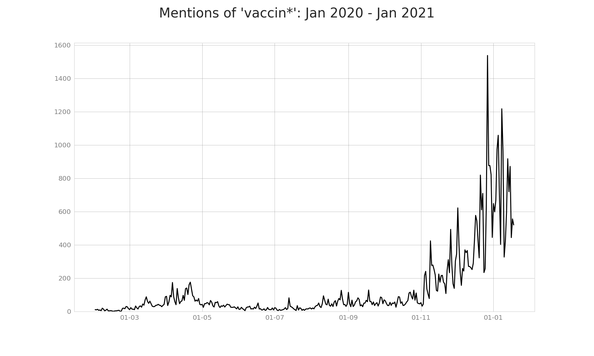
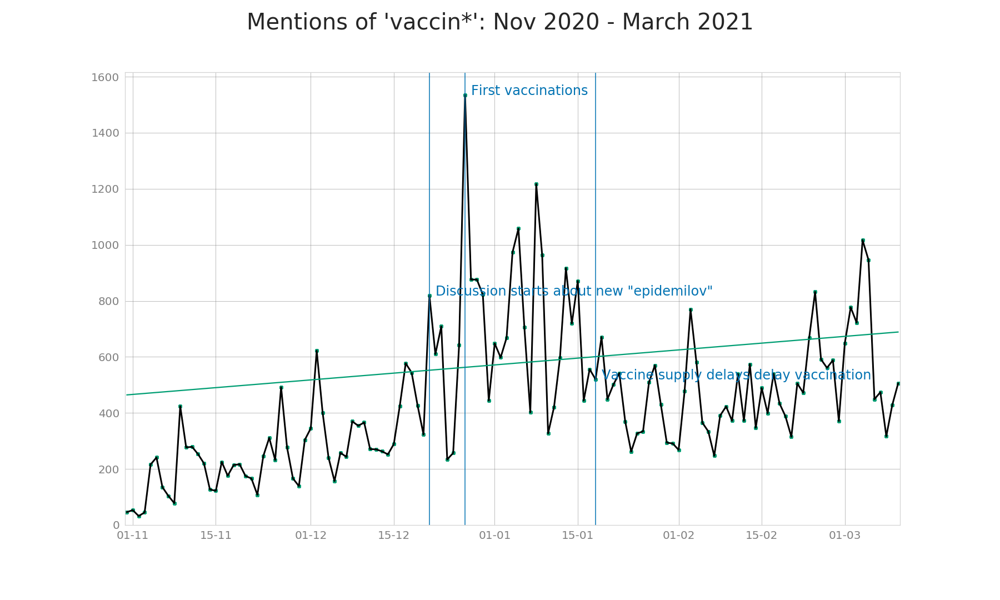
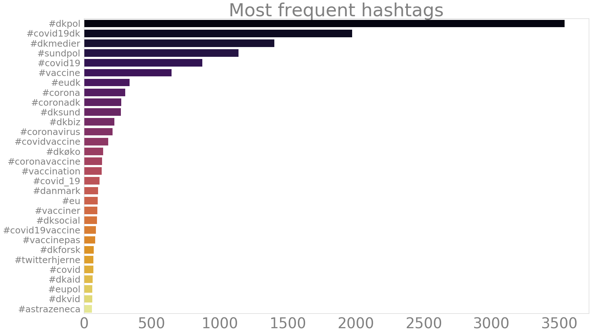
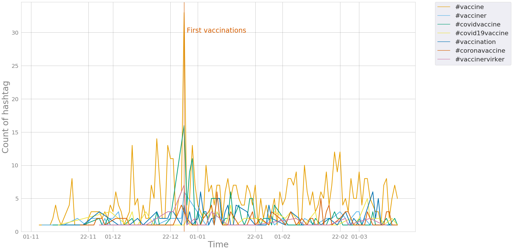
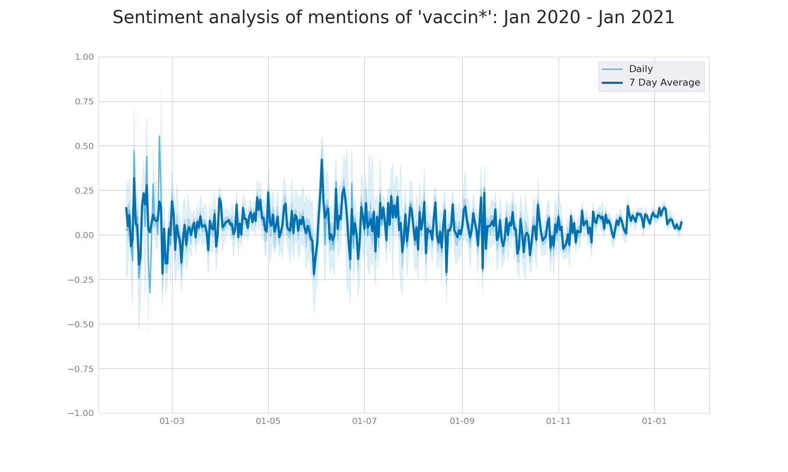
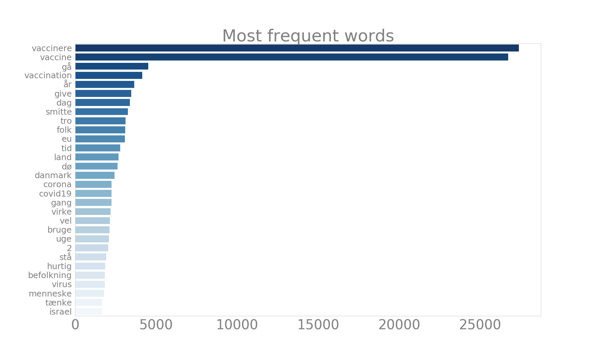
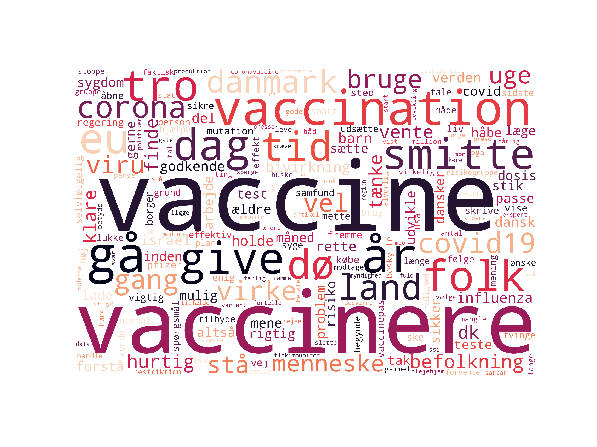
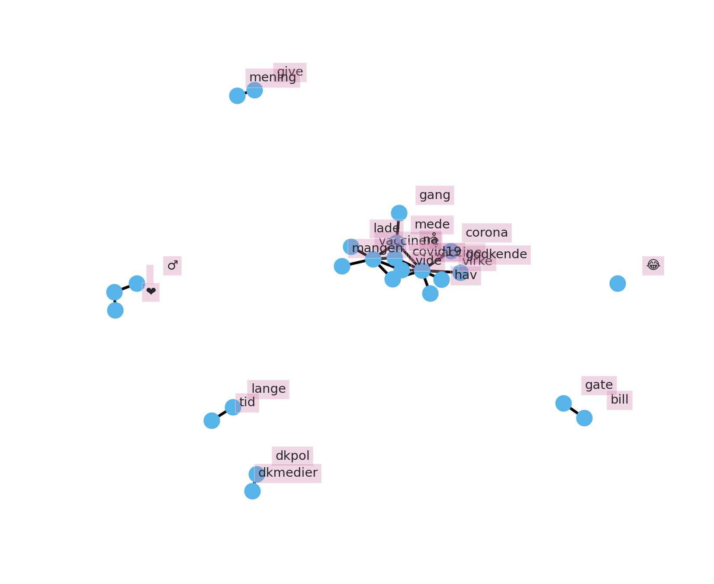

# HOPE: Mentions of vaccines in the Danish Twitter
This repository contains an overview of the discourse on the Danish Twitter in relation to vaccines.

Data was collected with searching for matches in the tweets for keyword "vaccin". Overall, there are **70 105** matching tweets, with an average of **483** tweets per day.

## Date range
1.01.2020 until 10.03.2021

## Preprocessing
Retweets were discarded, and quote tweets were removed. The way of removal was via checking whether the 50 first characters overlapped between the tweets in the dataset (user mentions in the beginning of tweets were ignored).

## Time series analysis

The above figure shows the total mentions of vaccines over time. There is some elevanted discourse about vaccines in April 2020, but the highest numbers are seen starting from 1.11.2020.

Vaccine mentions from 1.11.2020 skyrocketed around January 2021, and have gone down a bit afterwards. 

## Frequent hashtags
A hashtag analysis was conducted to see if there might be a trending hashtag popping up in the dataset.

These are the 30 most popular hashtags used in the dataset. The most popular hashtags are popular hashtags related to Covid-19 - #dkpol, #covid19dk, #dkmedier, #covid19, #sundpol. Several vaccine related hashtags show up.

Here the vaccines related hashtags are plotted against each other over time to see which ones are used most often and when.

## Sentiment analysis
The compound semantic scores were calculated with the Danish Vader. Overall the sentiment remains within the neutral range. It's also visible that the more data, the less the sentiment varies, and from November 2020 until January 2021 the sentiment scores lie on the positive side of the scale.

## Word frequency
For the following analysis, all tweets were tokenized and lemmatized, to make sure that different forms of “vaccin” would be considered as its stem form. Stop words were removed.

The word frequency plot shows that after removing stop words, it’s clear that the data centers around vaccinations. The discourse is also related to "vide" - "to know" and other related topics to vaccines (Covid19, spread, death).

The word cloud below exacerbates visually the effect of vaccines being the central talking points in this dataset.

## Bigram network analysis
A network-bigram analysis was conducted on the data to investigate which words co-occur. This enables the visualization of bi- and trigrams which the previous word frequency analysis neglects.

The figure shows clusters such as "dkmedier", "covid19dk", "dkpol" - the most popular Covid19 related hashtags, "bill" and "gate" for "gates", "cluster" and "5" for the mink mutation form referred to as Cluster 5. In the large network component, some of the core words that relate to others are "vaccinere" which connects to "covid19", "lade", "hurtig", "dansker", "befolkning". "vaccine" is connected to "covid19", "tage", "udvikle", "passe", "corona", "covid", "tilbyde", "godkende", "virke", "give" and "mening", "dø".
