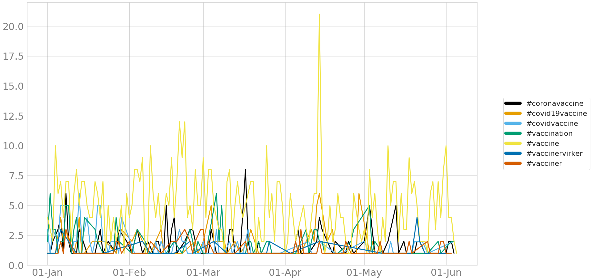
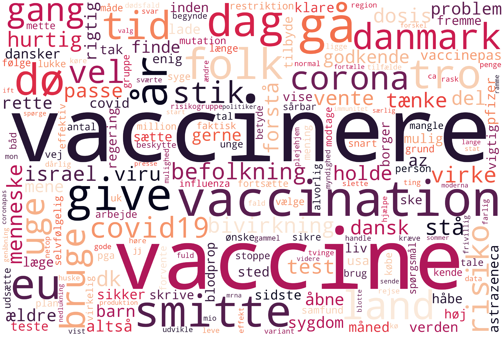
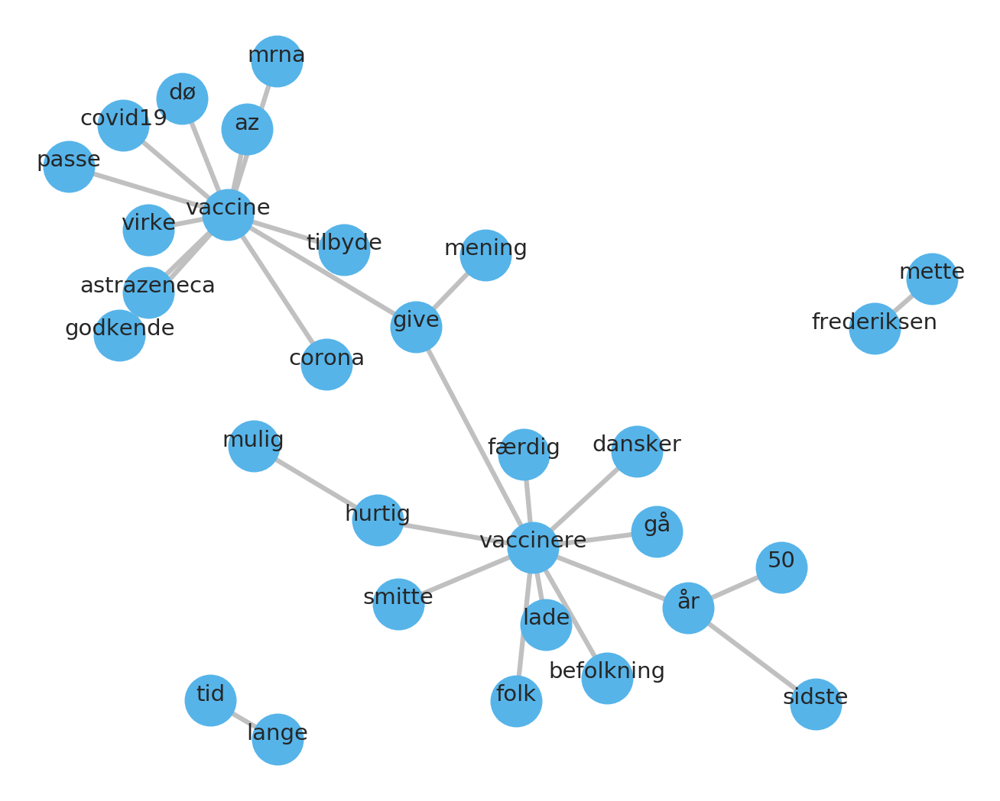

# HOPE: Mentions of vaccines in the Danish Twitter
This repository contains an overview of the discourse on the Danish Twitter in relation to vaccines.

Data was collected with searching for matches in the tweets for keyword "vaccin". Overall, there are **70 105** matching tweets, with an average of **483** tweets per day.

## Author
Maris Sala

## Repository
The explanations on what this repository consists of can be found in the markdown file ``explaning-folder.md``. The data is gathered with the codes gathered in this repository: https://github.com/marissala/hope-keyword-query-Twitter
The output data (includes the tweets, when they were created, sentiment scores, smoothed number of mentions and sentiment) is in the ``hope-keyword-query`` folder on the Grundtvig server at CHCAA. The data file itself is not stored in this folder.

## Date range
1.01.2021 until 05.06.2021

## Preprocessing
Retweets were discarded, and quote tweets were removed. The way of removal was via checking whether the 50 first characters overlapped between the tweets in the dataset (user mentions in the beginning of tweets were ignored).

## Time series of mentions

The above figure shows the total mentions of vaccines over time in 2021.

## Frequent hashtags
A hashtag analysis was conducted to see if there might be a trending hashtag popping up in the dataset.

These are the 30 most popular hashtags used in the dataset. The most popular hashtags are popular hashtags related to Covid-19 - #dkpol, #covid19dk, #dkmedier, #sundpol, #covid19. Several vaccine related hashtags show up.

Here the vaccines related hashtags are plotted against each other over time to see which ones are used most often and when.

## Sentiment analysis

Plotting number of mentions of vaccines in Twitter compared to averaged and centered compound sentiment scores shows a few trends:
1. The sentiment in the beginning of the year tends to be positive
2. The sentiment drops below 0 after AstraZeneca is halted and remains low
3. A new low in the sentiment occurs when J&J is withdrawn
4. The days where highly valent negative events occur (AZ halted, AZ withdrawn, J&J withdrawn), there are also spikes in number of mentions, meaning that the average sentiment scores for those days are more certain

An analysis of compound sentiment compared to entropy shows relations where some events are drivers for more uncertainty in Twitter about the sentiment around vaccines.

### AstraZeneca and Pfizer
Comparing the sentiments around these two popular vaccines results with the following plot.

The mentions are mostly on the positive scale for both vaccines, however towards March AstraZeneca seems to have generally lower scores more often that Pfizer. Note - the y scale has been rescaled to show the effects better.

## Word frequency
For the following analysis, all tweets were tokenized and lemmatized, to make sure that different forms of “vaccin” would be considered as its stem form. Stop words were removed.

The word frequency plot shows that after removing stop words, it’s clear that the data centers around vaccinations. The discourse is also related to "vide" - "to know" and other related topics to vaccines (Covid19, spread, death).

The word cloud below exacerbates visually the effect of vaccines being the central talking points in this dataset.

## Bigram network analysis
A network-bigram analysis was conducted on the data to investigate which words co-occur. This enables the visualization of bi- and trigrams which the previous word frequency analysis neglects.

The figure shows clusters around vaccine and vaccinere. Outside clusters are "tid" and "lange", and Mette Frederiksen.