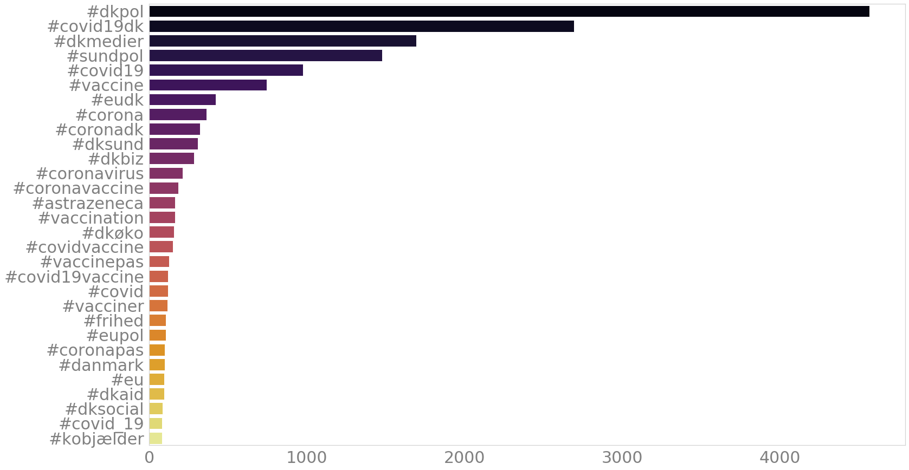
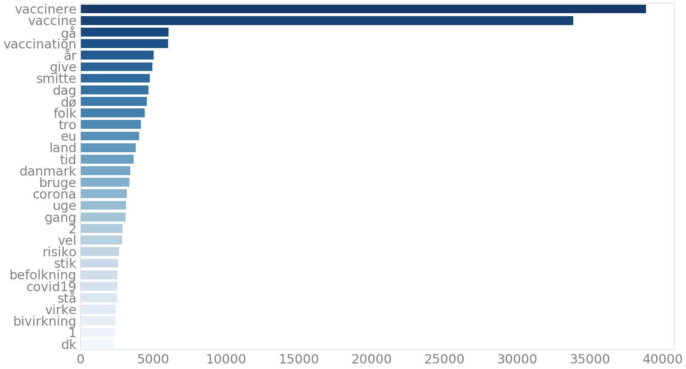

# HOPE: Mentions of vaccines in the Danish Twitter
This repository contains an overview of the discourse on the Danish Twitter in relation to vaccines.

Data was collected with searching for matches in the tweets for keyword "vaccin". Overall, there are **73 716** matching tweets, with an average of **528** tweets per day.

## Date range
1.01.2020 until 15.03.2021

## Preprocessing
Retweets were discarded, and quote tweets were removed. The way of removal was via checking whether the 50 first characters overlapped between the tweets in the dataset (user mentions in the beginning of tweets were ignored).

## Time series analysis

The above figure shows the total mentions of vaccines over time in terms of number of tweets per day. There is some elevanted discourse about vaccines in April 2020, but the highest numbers are seen starting from 1.11.2020. One of the highest peaks of mentions are the day first Danish people got vaccinated.

Zooming in to the time of elevated vaccine mentions in Twitter there is a pattern of more mentions around the first vaccination with lower number of mentions in Feburary. In March the vaccine discourse appears to be on the rise.

### AstraZeneca and Pfizer
The below figure shows the mentions patterns for AstraZeneca and Pfizer vaccines.

## Frequent hashtags
A hashtag analysis was conducted to see if there might be a trending hashtag popping up in the dataset. All hashtags which occurred in the tweets in this dataset were aggregated and the top 30 are visualized in the following plot.

The most popular hashtags are popular hashtags related to Covid-19 - #dkpol, #covid19dk, #dkmedier, #sundpol, #covid19. Several vaccine related hashtags show up afterwards together with other topical hashtags related to Covid-19 or vaccines.

Here the vaccines related hashtags are plotted against each other over time to see which ones are used most often and when. #vaccine is most popular in most of the days.

## Sentiment analysis
The compound sentiment scores were calculated with the Danish Vader to show the positivity, neutrality or negativity of tweets per day.

Typically average sentiment scores over such a large dataset remain around the neutral range - this is observable in the vaccines dataset. It's also visible that the more data, the less the sentiment varies, and from November 2020 until January 2021 the sentiment scores lie mostly on the positive side of the scale.

Zooming in on the data from 1st Jan until March 2021 it's visible that the sentiment almost doesn't get negative but remains in the positive side of the scale.

*Note: the y scale has been adjusted to show the effects more clearly*.

### AstraZeneca and Pfizer
AstraZeneca and Pfizer are some of the popular vaccines used against Covid-19 in Denmark. Their mentions in tweets were captured and sentiment analysis with the Danish Vader was conducted on them with the same methods as in the vaccines dataset sentiment analysis.

The mentions are mostly on the positive scale for both vaccines, however towards March AstraZeneca seems to have generally lower scores more often that Pfizer. AstraZeneca's average scores tend to be lower than Pfizer's.

*Note: the y scale has been rescaled to better highlight the effects.*

## Word frequency
For the following analysis, all tweets were tokenized and lemmatized, to make sure that different forms of “vaccin” would be considered as its stem form. Stop words were removed.

The word frequency plot shows that after removing stop words, it’s clear that the data centers around vaccinations. The discourse is also related to spread, death, people, EU.

The word cloud below exacerbates visually the effect of vaccines being the central talking points in this dataset.

## Bigram network analysis
A network-bigram analysis was conducted to investigate which words co-occur. This enables the visualization of bi- and trigrams which the previous word frequency analysis neglects.

The figure shows smaller clusters such as Bill Gates, 5g, Mette Frederiksen, lange tid. One larger cluster is formed with vaccinere in the center, and words like hurtig, lade, gå, folk, befolkning.
The biggest cluster is centered around vaccine. It's surrounded by words relatingt to Covid-19, influenza, death.
